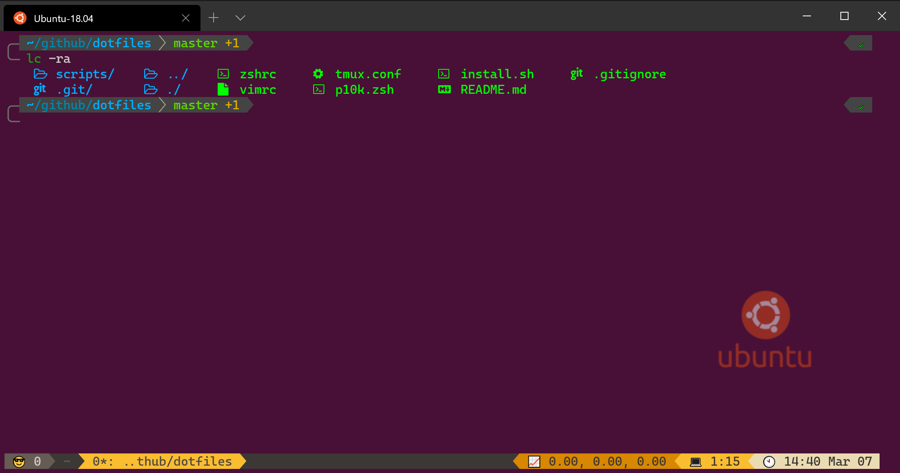

# my dotfiles
The dotfiles in this repo are the ones that I used in my environments. The files were created and tested on WSL2 and Ubuntu 18.04.



Feel free to fork the repo but use it at you own risk. 

## Prerequisites

- [Nerd Font](https://www.nerdfonts.com/) for your terminal, such as [Cascadia Code PL](https://github.com/microsoft/cascadia-code/releases). I used [this patch](https://github.com/ryanoasis/nerd-fonts/tree/master/patched-fonts/CascadiaCode) in Windows Terminal. 

## Install

```
git clone https://github.com/chunliu/dotfiles ~/.dotfiles
sh ~/.dotfiles/install.sh
```

You can use `p10k config` to configure Powerlevel10k theme. 
> ⚠ The `instant prompt` feature of Powerlevel10k doesn't work very well with Windows Terminal. It should be turned off if you are using Windows Terminal. 

To install the plug-ins in Vim, open Vim and run `:PlugInstall`. 

